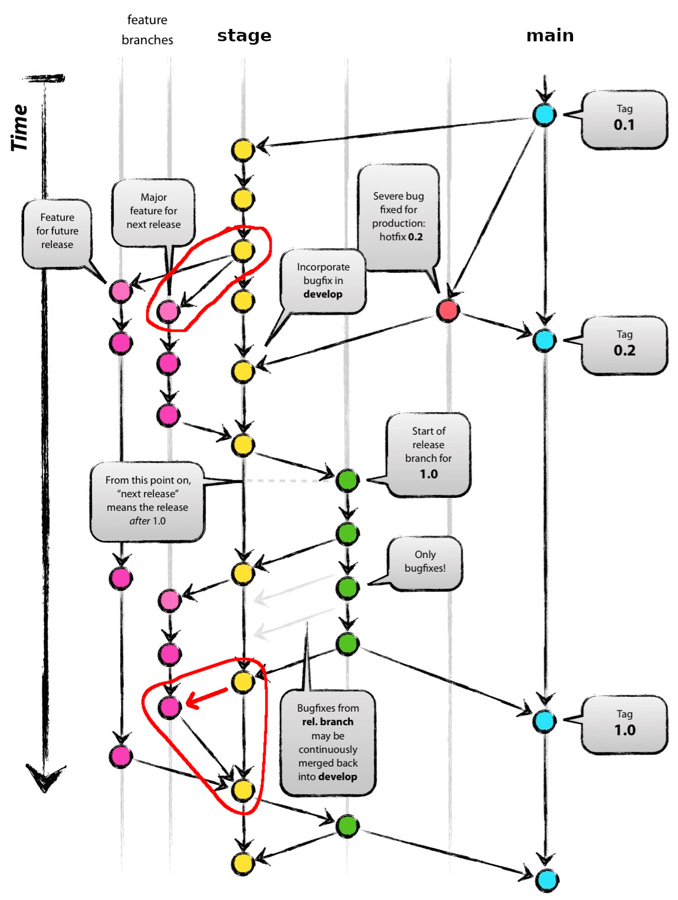
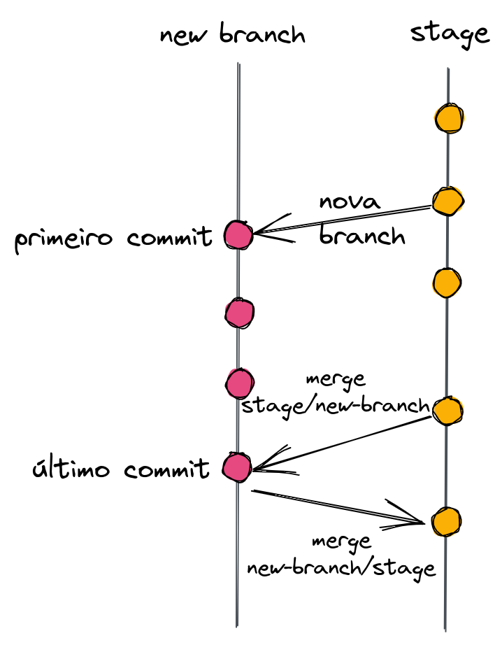

## Issues

Usaremos as issues como micro-tarefas. Será um complemento do Trello.

Podemos usar tags como: bug, doc, test, etc.


## Branchs





Vamos trabalhar com a branch `stage`.


### Sequência para criar e mergear branchs com a stage

```
git checkout -b new-branch  # deve ser em slug

# Escreva seu código

# Faça seus commits
git commit -m 'feat: adiciona base do projeto. close #2'
```

Antes de finalizar a tarefa, atualize sua branch com a `stage`.

```
git checkout stage
git pull
git checkout new-branch
git merge stage
```

Agora é a hora de resolver conflitos, caso tenha.

E depois faça o último.

`git push`


## isort

Se possível, tente usar o [isort](https://pycqa.github.io/isort/) antes dos commits.

```
isort -m 3 *
```


## Commits

O ideal é que os commits sejam atômicos, ou seja, um commit para cada alteração significativa e para cada arquivo diferente.

### Tipo

- ci: Mudanças nos arquivos relacionados com CI/CD (exemplo: Travis, Gitlab CI)
- docs: Somente alterações de documentação
- feat: Uma nova feature
- fix: Bug fix
- perf: Código relacionado a performance
- refactor: Alteração de código relacionado a melhoria técnica, correção de bug, refatoração de código. Mas não é uma nova feature
- style: Alterações relacionadas com code style, pipeline, PEP, isort, black (white-space, formatting, missing semi-colons, etc)
- test: Testes unitários, de integração, behaviour, etc

Exemplo:

```
feat: implementação do método de login. close #1
test: teste de autenticação. close #1
feat: adiciona lista de usuários. close #2
refactor: melhoria no script de importação de dados da planilha. close #3
```

### Fechamento de Issues

Cada issue pode ser fechado com a tag `close #<num_issue>` no final da mensagem de commit.

[Opções disponíveis para o GitLab](https://docs.gitlab.com/ee/user/project/issues/managing_issues.html#default-closing-pattern)

* `Close`, `Closes`, `Closed`, `Closing`, `close`, `closes`, `closed`, `closing`
* `Fix`, `Fixes`, `Fixed`, `Fixing`, `fix`, `fixes`, `fixed`, `fixing`
* `Resolve`, `Resolves`, `Resolved`, `Resolving`, `resolve`, `resolves`, `resolved`, `resolving`
* `Implement`, `Implements`, `Implemented`, `Implementing`, `implement`, `implements`, `implemented`, `implementing`

Exemplo:

```
feat: adiciona fluxo de permissões. close #4
fix: correção dos bugs de importação de dados. closes #5 #6
```


## Pull Request ou Merge Request

O PR, ou Pull Request, é uma ação feita pela plataforma do Gitlab para enviar a tarefa, uma para cada branch.

**Atenção:** Criar o PR pedindo para mergear da `new-branch` para a `stage`.
